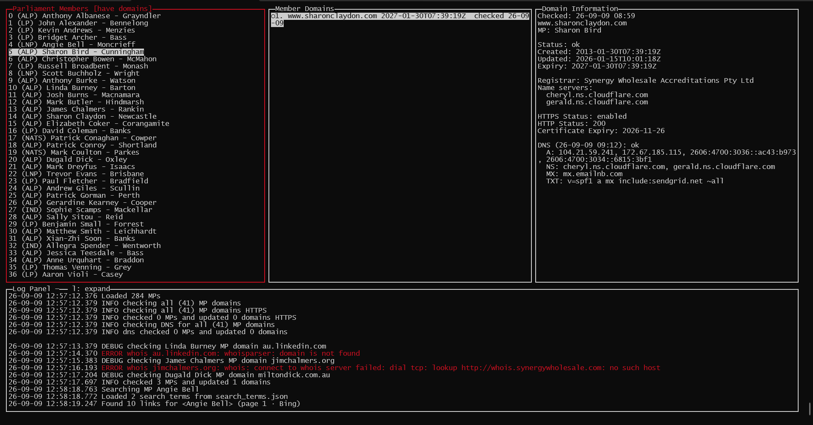

# Domain Sniper

## Description
A custom purpose TUI/CLI for tracking domains that might expire soon.
- import any shape CSV file of targets, or predefined values
- easily search DuckDuckGo/Bing from within the TUI to find websites for the target
- check DNS for records indicating website handover to DNS registrar
- check HTTPS certificate statuses to indicate for forgotten website
- check WHOIS for expiry information and to see if its for sale
- raise an alert if anything indicates the domain might be expiring soon
- a fancy startup screen



## What is the purpose of this?
To build a build a toy app in a TUI. Originally I started this by hand to improve my go and TUI skills, but with LLM assisted development features were added much faster. I have no clue what to do with this tool now. 

## Generate source database

Import APH CSVs into MP JSON: [IMPORT_CSV.md](docs/IMPORT_CSV.md).

### Debug alert fixtures

`mp_debug_examples.json` holds six `DEBUG *` MPs (also prepended at the top of `mp_data.json`) for UI alert demos. Filter **have alerts** to find them. Fresh `lastChecked` / `checkedAt` values avoid background WHOIS/DNS/HTTPS overwriting the fixtures for ~10 days.

| Surname | Alert reason(s) | Notes |
| ------- | --------------- | ----- |
| `HttpsCertError` | `https-expired` | Certificate past `notAfter` |
| `DnsExpirySoon` | `soon` | Domain/WHOIS expiry within 90 days (no separate DNS-expiry alert) |
| `DnsExpired` | `expired` | Domain/WHOIS expiry in the past |
| `DnsMissing` | `dns-empty` | Empty DNS / no records |
| `WhoisExpirySoon` | `soon` | WHOIS expiry within 90 days |
| `WhoisExpired` | `expired` | WHOIS expiry in the past |

## Build and run

### Quickstart

`go run main.go`

### Build and installation details

Requires [Go](https://go.dev/dl/) (module targets Go 1.17+).

From the project root:


```powershell
go build
.\politicaldissidence.exe
```

Or in one step without writing a binary:

```powershell
go run .
```

Headless domain refresh (WHOIS + DNS + HTTPS, no TUI) — useful for scripts / cron:

```powershell
go run ./cmd/checkdomains
go run ./cmd/checkdomains -dry-run
```

`-dry-run` classifies alerts from persisted data only (no network, no save). Live runs persist unless you pass `-save=false`.

Or build and run the executable:

```powershell
go build -o checkdomains.exe ./cmd/checkdomains
.\checkdomains.exe
.\checkdomains.exe -dry-run # only look at current data
.\checkdomains.exe -v
.\checkdomains.exe -soon-days 90 -delay 1s
.\checkdomains.exe -save=false # do not save JSON DB
```

Merge two MP JSON databases into a new file (dedupe by name; never overwrites `-o`):

```powershell
go run ./cmd/mergeDatabases -a .\mp_data.json -b .\mps_from_csv.json
go run ./cmd/mergeDatabases -a .\mp_data.json -b .\mps_from_csv.json -o .\mps_merged.json
```

Or build and run the executable:

```powershell
go build -o mergeDatabases.exe ./cmd/mergeDatabases
.\mergeDatabases.exe -a .\mp_data.json -b .\mps_from_csv.json -o .\mps_merged.json
```

Details: [cmd/mergeDatabases/README.md](cmd/mergeDatabases/README.md) and [SPEC_MERGE_DATABASES.md](docs/specs/SPEC_MERGE_DATABASES.md).

## CSV refresh (`csv_refresh.json`)

Ctrl+L (and the optional hourly ticker) fetch/parse **every** entry in `csv_refresh.json` and merge into memory. The whole file is reloaded each run (no restart needed for URL / filename / format changes). Nothing is written until **Ctrl+S**.

```json
{
  "interval": "1h",
  "entries": [
    {
      "csvSourceURL": "https://www.aph.gov.au/Senators_and_Members/Contacting_Senators_and_Members/Address_labels_and_CSV_files",
      "csvFilename": "allsenel.csv",
      "format": "senators"
    },
    {
      "csvSourceURL": "https://www.aph.gov.au/Senators_and_Members/Contacting_Senators_and_Members/Address_labels_and_CSV_files",
      "csvFilename": "FamilynameRepsCSV.csv",
      "format": "members"
    }
  ]
}
```

| Field | Required | Notes |
| ----- | -------- | ----- |
| `interval` | no | Ticker period, Go duration string (default `1h`; armed at startup) |
| `entries` | yes | One or more CSV sources (must be non-empty) |
| `entries[].csvSourceURL` | yes | HTTPS listing page that links to the CSV |
| `entries[].csvFilename` | no | Substring matched in `<a href>` (default `allsenel.csv`) |
| `entries[].format` | no | `senators`, `members`, or `custom` (default `senators`) |
| `entries[].columns` / `level` | for `custom` | Header map + optional MP level — see [SPEC_BACKGROUND_CSV_REFRESH.md](docs/specs/SPEC_BACKGROUND_CSV_REFRESH.md) |

APH examples: senators → `allsenel.csv` / `senators`; House of Reps → `FamilynameRepsCSV.csv` / `members`.

Headless CSV refresh (same pipeline as Ctrl+L; no TUI). Always a dry run — merges in memory only and never writes `mp_data.json`:

```powershell
go run ./cmd/csvrefresh
go run ./cmd/csvrefresh -v
```

See [cmd/csvrefresh/README.md](cmd/csvrefresh/README.md).
On macOS / Linux (or Git Bash), the `make` script builds then runs:

```sh
./make
```

That script runs `go build` and, on success, `./politicaldissidence`.

## Search terms (`search_terms.json`)


Guess-domain search (**g**) loads query templates from `search_terms.json` next to the app. Each template is a Go `text/template` rendered from the selected MP. The file is reloaded when opening the search flow (no restart needed after edits). Missing or invalid config falls back to the two built-in terms (`SearchTerm1` / `SearchTerm2`).

From Select a URL, **t** opens a **Select a search term** modal; **←** / **→** page terms there (wrap at ends). **Enter** searches with the chosen term; last chosen term index is kept for the session.

```json
{
  "terms": [
    {
      "id": "t1",
      "label": "T1",
      "template": "{{.NameWithHonorific}} member for {{.Electorate}} {{.Party}} "
    },
    {
      "id": "t2",
      "label": "T2",
      "template": "{{.Name}} member for {{.Electorate}} {{.Party}} "
    }
  ]
}
```

| Field | Required | Notes |
| ----- | -------- | ----- |
| `terms` | yes | One or more templates (must be non-empty) |
| `terms[].id` | no | Stable slug for logs (default `T1`, `T2`, …) |
| `terms[].label` | no | Short name for UI / console (default = `id` or `T{n}`) |
| `terms[].template` | yes | Go `text/template` over MP fields (below) |

Template placeholders: `{{.Honorific}}`, `{{.FirstName}}`, `{{.Surname}}`, `{{.OtherName}}`, `{{.PreferredName}}`, `{{.Electorate}}`, `{{.Party}}`, `{{.State}}`, `{{.Level}}`, `{{.Name}}`, `{{.NameWithHonorific}}`.

Details: [SPEC_CUSTOM_SEARCH_TERMS.md](docs/specs/SPEC_CUSTOM_SEARCH_TERMS.md).

## Keyboard shortcuts

See [KEYBOARD_SHORTCUTS.md](docs/KEYBOARD_SHORTCUTS.md).

## Environment variables

See [ENVIRONMENT.md](docs/ENVIRONMENT.md) for all runtime env flags (background WHOIS/DNS/HTTPS, 30-minute periodic rechecks, CSV ticker, title screen skip).

## Specs

- [Background WHOIS refresh](docs/specs/SPEC_BACKGROUND_WHOIS.md)
- [WHOIS information panel](docs/specs/SPEC_WHOIS_PANEL.md)
- [DNS emptiness check](docs/specs/SPEC_DNS_EMPTY.md)
- [CLI batch domain watchlist](docs/specs/SPEC_CLI_EXPIRED_DOMAINS.md)
- [Domain-added background jobs](docs/specs/SPEC_DOMAIN_ADDED_JOBS.md)
- [MP JSON validation on load / reload](docs/specs/SPEC_JSON_VALIDATION.md)
- [Atomic MP JSON save](docs/specs/SPEC_JSON_SAVE.md)
- [Select a URL modal improvements](docs/specs/SPEC_SELECT_URL_MODAL.md)
- [Select a URL search paging (v2)](docs/specs/SPEC_SELECT_URL_PAGING.md)
- [Select a URL searcher controls (v3)](docs/specs/SPEC_SELECT_URL_SEARCHER_V3.md)
- [Custom search terms](docs/specs/SPEC_CUSTOM_SEARCH_TERMS.md)
- [Merge MP JSON databases](docs/specs/SPEC_MERGE_DATABASES.md)
- [Hourly background CSV refresh](docs/specs/SPEC_BACKGROUND_CSV_REFRESH.md)

## TODO

- [x] Automating MP detection
    - [x] Get list of Senators and Reps
        - [x] Parse HTML [0] 
        - [x] Fetch CSV files
        - [x] Automatically import on schedule 
    - [x] Get list of territory and state Members and Senators
        - [x] Find sites 
        - [x] Parse HTML 
        - [x] Fetch CSV files 
        - [x] Automatically import on schedule
    - [x] From CSV files extract (Honorific) (Full Name + Prefered Name) (Party) (Electorate) into database
    - [x] Alert when new MP found
    - [x] Run background job every hour that: (see [SPEC_BACKGROUND_CSV_REFRESH.md](docs/specs/SPEC_BACKGROUND_CSV_REFRESH.md))
        - [x] Ctrl+L triggers a run (do not run on startup)
        - [x] Refetches CSV from the page linked in source code
            - [x] Source URL from config file
            - [x] HTTPS Lookup page 
            - [x] Find CSV download link on page by download file name (allsenel.csv)
            - [x] Download CSV link
            - [x] log any errors to console
            - [x] If CSV downloaded, follow next steps
        - [x] Outputs any CSV parsing errors to Console Log
        - [x] Run the MP merge logic like cmd/mergeDatabases does
        - [x] Console Log when new members are added or merged
        - [x] Let the user save manually
- [ ] CLI/TUI
    - [x] Linking MP and domain
    - [x] Display list of MPs requiring linkage
    - [ ] Search engines
        - [x] duckduckgo
        - [ ] google
        - [x] bing
        - [ ] bypass google/ddg rate limit 
        - [x] pagination
        - [x] automatic fallthrough to other domains when search fails
    - [x] Allow CRUD to set domain to MP
    - [x] WHOIS lookup to check domain
        - [x] Perform WHOIS and get expiry date
        - [x] Background WHOIS refresh (see [SPEC_BACKGROUND_WHOIS.md](docs/specs/SPEC_BACKGROUND_WHOIS.md))
        - [x] Domain-added jobs kickoff (see [SPEC_DOMAIN_ADDED_JOBS.md](docs/specs/SPEC_DOMAIN_ADDED_JOBS.md))
        - [x] Persist domain `lastChecked` on WHOIS
        - [x] Show last-checked in domain panel
        - [x] Show full WHOIS response
        - [x] DNS emptiness check (see [SPEC_DNS_EMPTY.md](docs/specs/SPEC_DNS_EMPTY.md))
        - [x] Add script for running WHOIS checks against all MP domains and outputting expired domains (see [SPEC_CLI_EXPIRED_DOMAINS.md](docs/specs/SPEC_CLI_EXPIRED_DOMAINS.md))
    - [x] Validate `mp_data.json` on load / reload (see [SPEC_JSON_VALIDATION.md](docs/specs/SPEC_JSON_VALIDATION.md))
    - [x] Fix UI bugginess, cursor gets out of whack 
    - [x] Add multiple engines/search terms to url lookup
    - [x] DNS Record Checks as well as WHOIS
        - [x] [SPEC_DNS_EMPTY.md](docs/specs/SPEC_DNS_EMPTY.md)
    - [x] Import files easily
        - [x] easy config for modifying for different files
        - [x] HTTPS Certificate Checks (see [SPEC_HTTPS_CERT.md](docs/specs/SPEC_HTTPS_CERT.md))
        - [x] Add HTTP Status Checks
    - [x] Custom search terms JSON
    - [x] Custom DB Path
- [x] Maintainence 
    - [x] Detect when URL disappears (used statuses instead, works better for reporting)
    - [x] Alert when current list changes found/removed (added console logs when importing members)
    - [x] Check all domains on startup
    - [x] Re-check due domains every 30 minutes (toggle: `SKIP_PERIODIC_DOMAIN_CHECKS`; see [ENVIRONMENT.md](docs/ENVIRONMENT.md))
    - [x] WHOIS information panel (see [SPEC_WHOIS_PANEL.md](docs/specs/SPEC_WHOIS_PANEL.md))
    - [x] JSON Validation on startup/reload
    - [x] Add csv_refresh.json config steps
- [ ] Code
    - [ ] Figure out how and when to use `log` package, replace fmt.Println
    - [x] Cleanup CLI code base buginess / shit ness 


[0] https://www.aph.gov.au/Senators_and_Members/Contacting_Senators_and_Members/Address_labels_and_CSV_files


### gocui references

https://github.com/jroimartin/gocui
https://github.com/inconshreveable/ngrok/blob/master/src/ngrok/client/views/term/area.go 
https://github.com/esimov/diagram

